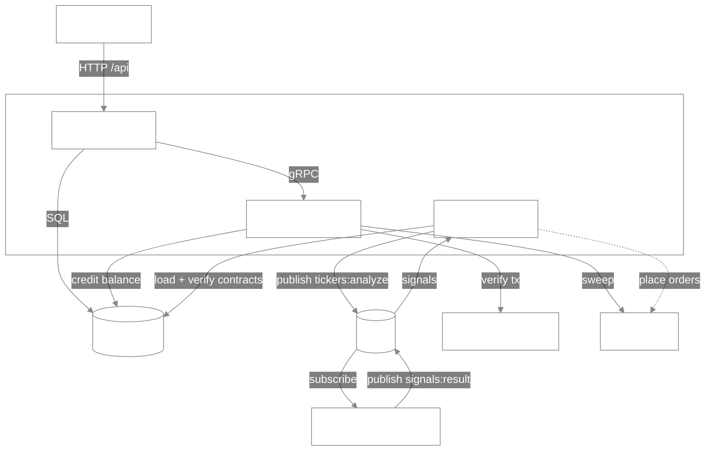
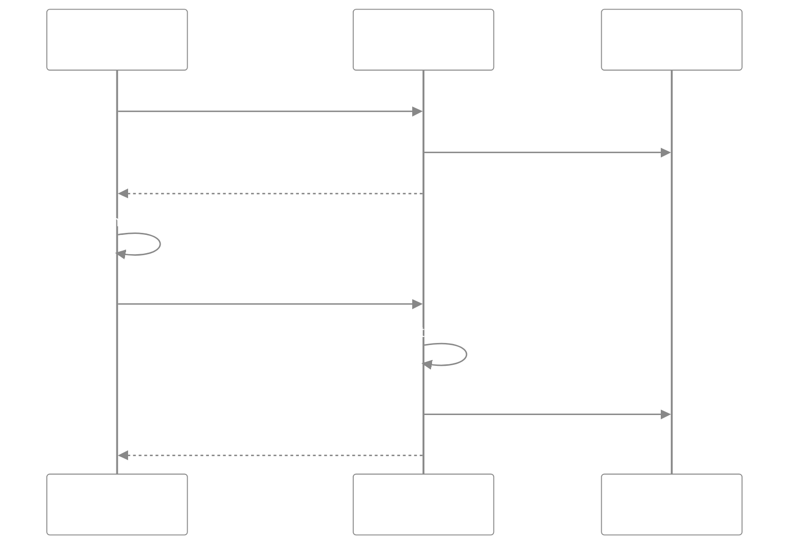
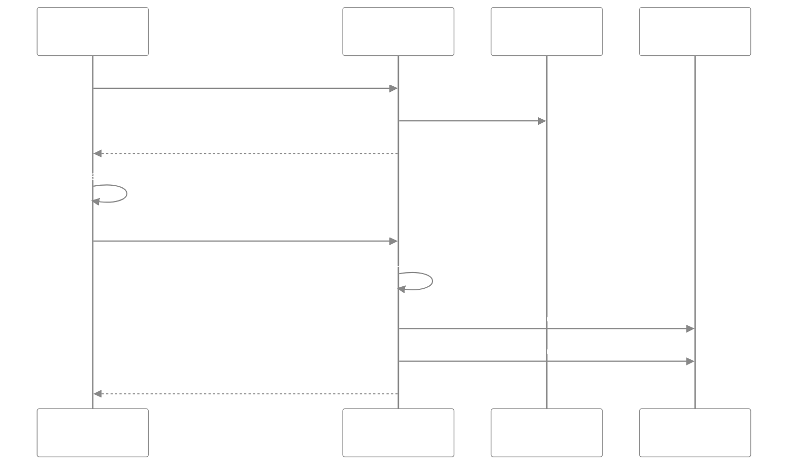
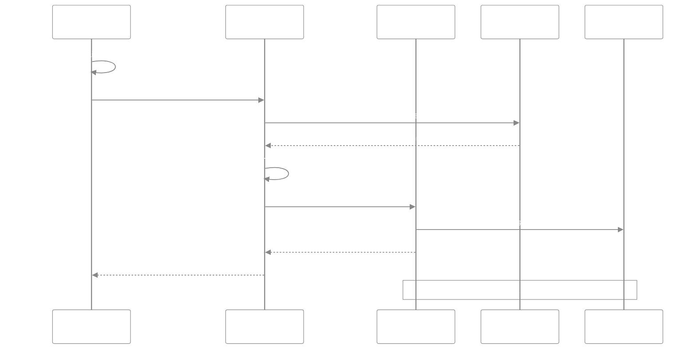
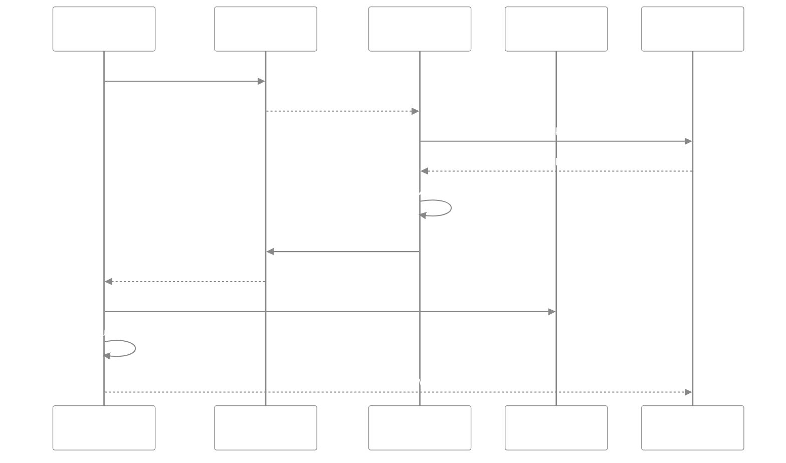

  

<b>Automated crypto trading — signed contracts, on-chain deposits, signal-driven execution.</b>

  
  
  
  
  
  
  
  
  
  
  
  
  

 

**CoinBot.v3** is an event-driven crypto trading platform that turns user-signed contracts into automated trades on KuCoin futures. Users authenticate with an Ethereum wallet, deposit USDT on-chain, and sign a contract allocating funds to a strategy; a Rust **trade engine** consumes RSI-divergence signals from a Python **analyzer** and executes them, while an **API gateway** and **deposit worker** handle wallet auth, contract signing, and on-chain deposit verification.

## Processes

| Process          | Path                     | Role                                                    | Talks to                                      |
| ---------------- | ------------------------ | ------------------------------------------------------- | --------------------------------------------- |
| `api_gateway`    | `process/api_gateway`    | HTTP API — auth, contract signing, deposit intake       | React, PostgreSQL, deposit-worker             |
| `deposit-worker` | `process/deposit-worker` | gRPC ticket + background deposit sweeper                | api_gateway, PostgreSQL, Ethereum RPC, KuCoin |
| `trade-engine`   | `process/trade-engine`   | Publishes tickers, consumes signals, verifies contracts | Redis, PostgreSQL, KuCoin                     |
| `analyzer`       | `process/analyzer`       | signal engine (Python)                                  | Redis, KuCoin                                 |

Shared infrastructure: **PostgreSQL** (`users`, `deposits`, `contracts`, `trade_orders`) and **Redis** (pub/sub channels `tickers:analyze`, `signals:result`).

## Flows

### Authentication

Wallet challenge/response login — proves wallet ownership and issues a session cookie.

### Contract signing

Authorize a strategy — verify the signed settings and lock the allocated funds on a new contract.

### Deposit

On-chain USDT deposit — verify the transaction, then credit the user's balance.

### Trading

Signal to execution — match analyzer signals to active contracts, verify each signature, then execute.

