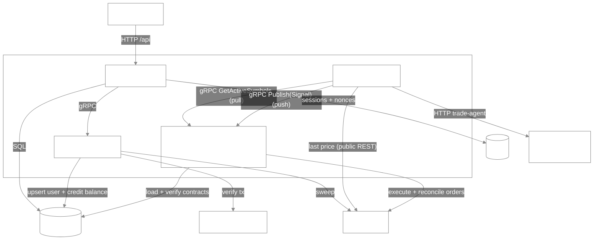

<div align="center">
  
</div>

<p align="center"><b>Trade on autopilot — your wallet, your funds, your rules.</b></p>

<div align="center">
  
  
  
  
  
  
  
  
  
  
  
  
  
</div>

<br />

Math does the watching. Our statistical models read the market around the clock, surface the trades worth taking, and fire them straight to KuCoin before the crowd even blinks.

## Processes


```mermaid
%%{init: {"theme":"base","themeVariables":{"clusterBkg":"transparent","clusterBorder":"#888","lineColor":"#888","primaryTextColor":"#fff","tertiaryTextColor":"#fff","edgeLabelBackground":"transparent"}}}%%
flowchart TB
    classDef plain fill:transparent,stroke:#888,color:#fff;

    UI["React SPA"]

    subgraph rust["Rust services"]
        GW["api_gateway"]
        DW["deposit-worker"]
        TE["trade-engine<br/>(gRPC server: EngineService)"]
        SG["signal-gateway"]
    end

    DB[("PostgreSQL")]
    RD[("Redis")]
    ETH["Ethereum RPC"]
    KC["KuCoin"]
    OC["opencode<br/>(trade-agent)"]

    UI -->|"HTTP /api"| GW
    GW -->|"SQL"| DB
    GW -->|"gRPC"| DW
    DW -->|"verify tx"| ETH
    DW -->|"sweep"| KC
    DW -->|"upsert user + credit balance"| DB

    SG -->|"gRPC GetActiveSymbols (pull)"| TE
    SG -->|"gRPC Publish(Signal) (push)"| TE
    SG -->|"HTTP trade-agent"| OC
    SG -->|"last price (public REST)"| KC

    GW -->|"sessions + nonces"| RD

    TE -->|"load + verify contracts"| DB
    TE -->|"execute + reconcile orders"| KC

    class UI,GW,DW,TE,SG,OC,DB,RD,ETH,KC plain;
```

| Process          | Role                                                                                                                                                                                                                                                                                                                        | Docs                                       |
| ---------------- | --------------------------------------------------------------------------------------------------------------------------------------------------------------------------------------------------------------------------------------------------------------------------------------------------------------------------- | ------------------------------------------ |
| `api_gateway`    | HTTP API — auth, contract signing, deposit intake                                                                                                                                                                                                                                                                           | [README](process/api_gateway/README.md)    |
| `deposit-worker` | gRPC ticket + background deposit sweeper                                                                                                                                                                                                                                                                                    | [README](process/deposit-worker/README.md) |
| `trade-engine`   | Turns `signal-gateway` signals into KuCoin **cross-margin** orders, reconciles them against the exchange, and exits positions on TP/SL when ATR is enabled or on an opposite target-side signal. Also serves the gRPC `EngineService` that `signal-gateway` calls. Sole writer of order rows and contract funds (via its `ledger`). | [README](process/trade-engine/README.md)   |
| `signal-gateway` | Runs 6x/day shortly after each 4h UTC candle close. Pulls active symbols sequentially with a round-robin start, asks the `opencode` trade-agent for a prediction per symbol, validates strict JSON and the entry price against KuCoin, then publishes to `trade-engine` over gRPC. | [README](process/signal_gateway/README.md) |
| `frontend`       | React SPA                                                                                                                                                                                                                                                                                                                   | [README](react/README.md)                  |

Shared infrastructure: **PostgreSQL** (`users`, `deposits`, `contracts`, `trade_orders`). **Redis** holds gateway sessions (DB 0) and login nonces (DB 1).

### Signal path

`trade-engine` serves `EngineService` (defined in `process/proto/analyzer.proto`). `signal-gateway` pulls `GetActiveSymbols` from the engine, calls the `trade-agent` for each active symbol, validates the prediction, and publishes it with `Publish`, which the engine answers with an `Ack`. The engine deduplicates on `signal_id`. See the [signal-gateway README](process/signal_gateway/README.md) for the full design.

## Repository layout

- `process/`: runtime services (`api_gateway`, `deposit-worker`, `trade-engine`, `signal_gateway`) plus `migrations/` (SQL, applied in order) and `proto/` (gRPC contracts, including `analyzer.proto` for the engine/signal-gateway link).
- `lib/share/`: shared Rust crate (config, DB models, Redis, RPC helpers).
- `react/`: frontend SPA.
- `docs/`, `scripts/`: project docs, demo seed data, and API smoke tests.

## Quick start

```bash
make dev     # Postgres + Redis + API + worker + trade-engine + frontend
make trade   # trade-engine + signal-gateway live (starts Postgres + Redis)
make test    # Rust tests
make ci      # full pipeline: fmt-fix, clippy, test, frontend lint-fix, frontend tests, build
```
