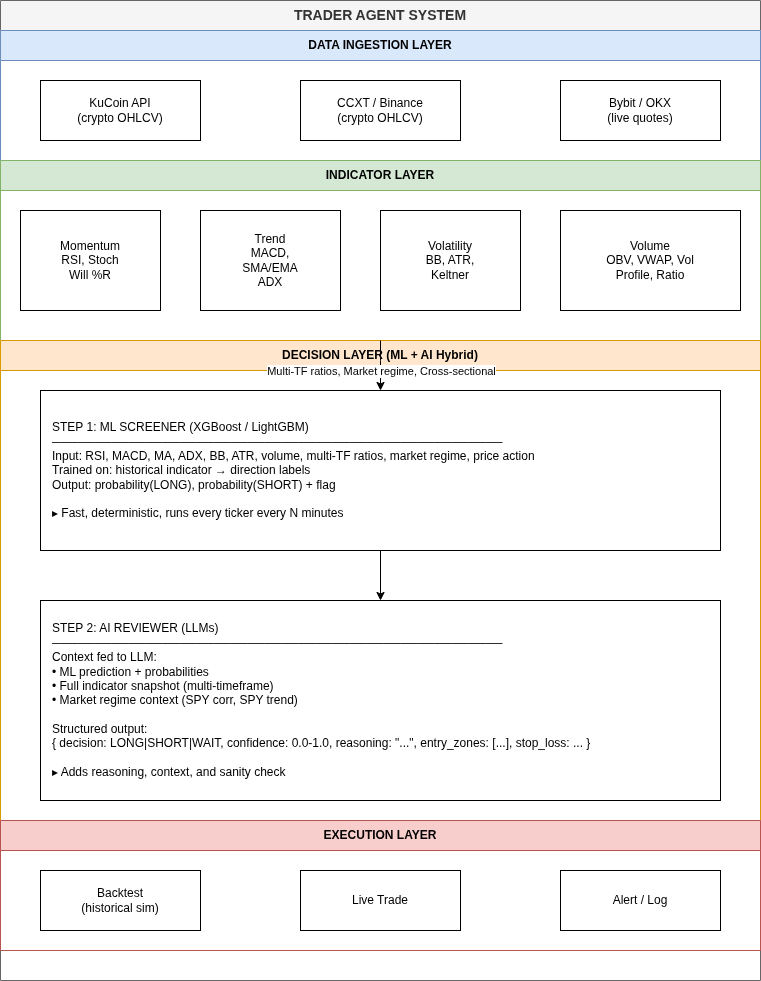
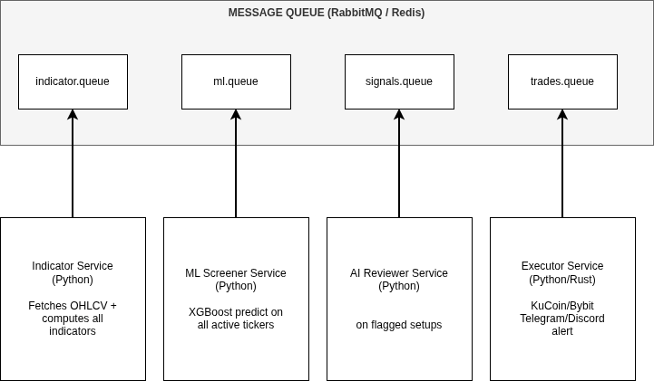
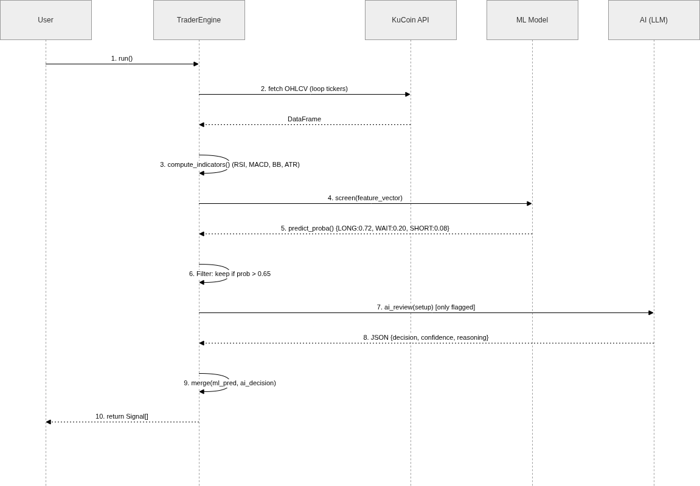

# Trade Engine — System Architecture

> **CoinBot V3** — A crypto-only automated trading engine combining classical technical indicators, gradient-boosted ML screening, and LLM-based AI review, deployed as a message-queue-driven microservices system.

---

## 1. System Overview

The diagram below depicts the **Trader Agent System** as a layered pipeline of four swimlane layers, each feeding into the next:



### Layers in Detail

| Layer                | Color  | Responsibility                                                                                                                                                                     |
| -------------------- | ------ | ---------------------------------------------------------------------------------------------------------------------------------------------------------------------------------- |
| **Data Ingestion**   | Blue   | Fetches raw OHLCV candles from KuCoin, Binance (via CCXT), and live quotes from Bybit/OKX                                                                                          |
| **Indicator**        | Green  | Computes 15+ technical indicators across four categories: Momentum, Trend, Volatility, Volume. Derives multi-timeframe ratios, market regime signals, and cross-sectional features |
| **Decision (ML+AI)** | Orange | Two-stage hybrid: fast ML screener narrows the universe, then an LLM reviewer adds reasoning and sanity checks on flagged setups only                                              |
| **Execution**        | Red    | Routes confirmed signals to backtesting (historical simulation), live trading (KuCoin/Bybit), and alerting (Telegram/Discord)                                                      |

---

## 2. Component Breakdown



### Services

| Service                 | Language      | Input Queue       | Role                                                                                                                                                                                                         |
| ----------------------- | ------------- | ----------------- | ------------------------------------------------------------------------------------------------------------------------------------------------------------------------------------------------------------ |
| **Indicator Service**   | Python        | `indicator.queue` | Pulls OHLCV from exchange APIs, computes the full indicator suite (RSI, MACD, BB, ATR, OBV, VWAP, ADX, Stoch, Will %R, Keltner Channels, Volume Profile, multi-TF ratios), and publishes enriched DataFrames |
| **ML Screener Service** | Python        | `ml.queue`        | Loads trained XGBoost/LightGBM models, runs `predict_proba()` on every active ticker, outputs {LONG, WAIT, SHORT} probability vectors with a flag threshold                                                  |
| **AI Reviewer Service** | Python        | `signals.queue`   | Receives only flagged (probability > 0.65) setups. Constructs a structured prompt with full indicator context + market regime data, calls LLMs, parses the structured JSON response                          |
| **Executor Service**    | Python / Rust | `trades.queue`    | Merges ML predictions with AI decisions, places orders, sends alerts, logs                                                                                                                                   |

## 3. Data Flow / Sequence



## 4. Data Flow Diagram (Indicators → ML → AI → Signal)

```
  ═══════════════════════════════════════════════════════════════════════
  SINGLE PIPELINE: INDICATORS → ML SCREENER → AI FINAL REVIEW
  ═══════════════════════════════════════════════════════════════════════

  FETCH PRICE DATA:
    KuCoin API ──→ BTC/USDT 1y daily OHLCV
         │
         ▼
  COMPUTE INDICATORS:
    rsi_14          = RSI(close, 14)                → 28.4
    stoch_k         = Stochastic %K(14,3,3)         → 12.5
    macd_line       = MACD line(12,26)              → -2.10
    macd_signal     = MACD signal(9)                → -3.30
    macd_histogram  = MACD histogram                → +1.20
    sma_dist_50     = (close - SMA50) / SMA50       → -2.3%
    sma_dist_200    = (close - SMA200) / SMA200     → +5.8%
    adx_14          = ADX(high, low, close, 14)     → 31.5
    bb_position     = (close - BB_lower) / (BB_upper- BB_lower) → 0.12
    atr_pct         = ATR(14) / close               → 2.8%
    volume_ratio    = vol_today / vol_20d_avg       → 1.8
    obv_change_5d   = (OBV_today - OBV_5d_ago) / OBV_5d_ago → +4.2%
    price_change_1d  = (close / close_1d_ago) - 1    → -1.5%
    price_change_5d  = (close / close_5d_ago) - 1    → -7.2%
    price_change_20d = (close / close_20d_ago) - 1   → -4.1%
    volatility_20d   = std(ret, 20)                  → 2.1%
    rsi_1d_div_4h    = 28.4 / 42.1                   → 0.67 (daily more oversold)
    macd_1d_div_4h   = -2.10 / 1.15                  → -1.83 (daily bearish, 4h bullish)
    adx_1d_div_4h    = 31.5 / 18.2                   → 1.73 (daily trend stronger)
    corr_to_btc_20d  = pearsonr(ret, btc_ret, 20)    → 0.72
    btc_trend_20d    = BTC 20d return                → +1.2%

  ═══════════════════════════════════════════════════════════════════════
  ML SCREENER
  ═══════════════════════════════════════════════════════════════════════

  ML MODEL (XGBoost trained on 5+ years of data):
    feature_vector ──→ model.predict_proba()
    → { LONG: 0.72, SHORT: 0.08, WAIT: 0.20 }

  FILTER:
    If max_prob > 0.65 and prob > 2× second-best → FLAG for AI review
    Else → SILENT WAIT (no action)

  Result: 500 tickers scanned → 3 flagged for AI review


  ═══════════════════════════════════════════════════════════════════════
  AI REVIEW (only on flagged setups)
  ═══════════════════════════════════════════════════════════════════════

  PROMPT TO LLM:
    ┌─────────────────────────────────────────────────────────────
    │ System: You are a trading analyst. Review the ML-predicted
    │ setup and decide: LONG, SHORT, or WAIT. Return JSON.
    │
    │ Indicators (raw values, no pre-interpretation):
    │   RSI(14)                         = 28.4
    │   Stoch %K                        = 12.5
    │   MACD line / signal / histogram  = -2.10 / -3.30 / +1.20
    │   SMA 50/200 dist                 = -2.3% / +5.8%
    │   ADX(14)                         = 31.5
    │   Bollinger pos                   = 0.12
    │   Volume ratio                    = 1.8x
    │   OBV 5d                          = +4.2%
    │   ATR(14)                         = 2.8%
    │   Returns: 1d=-1.5%, 5d=-7.2%, 20d=-4.1%
    │   Volatility(20d) = 2.1%
    │   RSI 1d/4h = 0.67  MACD 1d/4h = -1.83  ADX 1d/4h = 1.73
    │   BTC corr  = 0.72   BTC 20d = +1.2%
    │
    │ ML prediction: LONG (72% confidence)
    │
    │ Return JSON: {decision, confidence, reasoning, entry_zone,
    │               stop_loss_pct, take_profit_pct, risks}
    └─────────────────────────────────────────────────────────────

  LLM RESPONSE:
    {
      "decision": "LONG",
      "confidence": 0.82,
      "reasoning": "Triple oversold confluence (RSI 28, Stoch 12.5,
                    BB 0.12) with bullish MACD divergence and
                    positive OBV despite the -7.2% drawdown.
                    Golden cross still active. High probability
                    mean-reversion bounce. ML agrees at 72%.
                    Low VIX supportive for upside.",
      "entry_zone": [182.00, 184.50],
      "stop_loss_pct": 3.0,
      "take_profit_pct": 8.0,
      "risks": ["Momentum could continue downward if support at 180 breaks",
                "Low volume on recovery would invalidate the setup"]
    }
```
